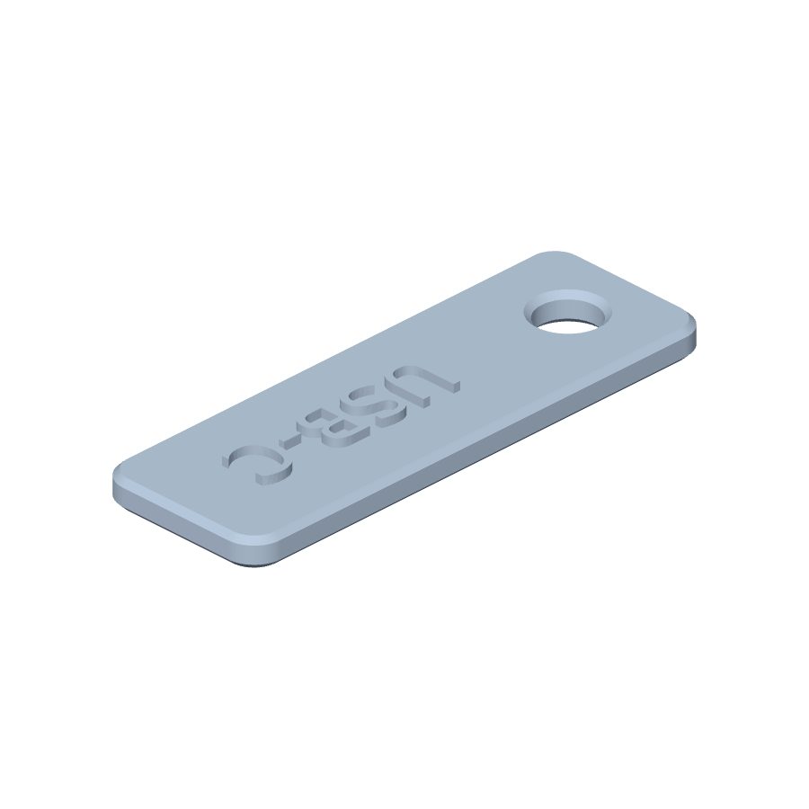

# shpit.dev skills

Hand-authored public Agent Skills for ShpitDev projects.

Skills are prompts, not generated docs. Each `skills/<name>/SKILL.md` should be
small, direct, and useful to a capable model with no private project context.

## Install

Install a skill with a compatible skills installer:

```bash
npx skills add shpitdev/skills --skill tabex
npx skills add shpitdev/skills --skill meshix
npx skills add shpitdev/skills --skill slant4d
```

For agents that read local Agent Skills directly, copy or install the folder
under `skills/<name>`.

For local Claude Code/project validation without copying skills into your home
directory, create ignored install shims:

```bash
bun run link:local
```

This links `.claude/skills` and `.agents/skills` to the canonical `skills/`
folder. `bun run check` validates those shims when they are present.

## Agent Plugins

Repo-managed plugins live under `plugins/<name>` and are exposed through
marketplace manifests for each harness. Prefer installing from the GitHub
marketplace source for normal use.

### Codex Plugins

Use the GitHub marketplace source for normal installs. This creates a
Git-backed marketplace named `shpitdev-skills`, which is the only form that
`codex plugin marketplace upgrade shpitdev-skills` can refresh.

Install all Codex plugins:

```bash
codex plugin marketplace add shpitdev/skills
codex plugin add meshix@shpitdev-skills
codex plugin add tabex@shpitdev-skills
codex plugin add slant4d@shpitdev-skills
codex mcp login meshix
codex mcp login slant4d
codex mcp add slant4d-codemode -- \
  npx -y mcp-remote@latest \
  'https://agents-portal.slant4d.com/mcp?codemode=search_and_execute'
```

Update an existing Codex install:

```bash
codex plugin marketplace upgrade shpitdev-skills
codex plugin remove tabex@shpitdev-skills
codex plugin add tabex@shpitdev-skills
```

Repeat the remove/add pair for `meshix` or `slant4d` when their bundled plugin
version changes. Meshix and Slant4D may also need `codex mcp login <name>` after
install because they register OAuth-backed MCP servers. Slant4D Code Mode should
show up as `slant4d-codemode`; it uses `mcp-remote` because Codex native HTTP
MCP does not authenticate the query-string Code Mode portal correctly.

If `marketplace upgrade` says `shpitdev-skills` is not configured as a Git
marketplace, the marketplace was added from a local path or stale snapshot. Fix
it by replacing the marketplace with the Git-backed source:

```bash
codex plugin marketplace remove shpitdev-skills
codex plugin marketplace add shpitdev/skills
codex plugin add tabex@shpitdev-skills
```

Check the configured source and installed versions with:

```bash
codex plugin marketplace list
codex plugin list --marketplace shpitdev-skills
```

Local checkout installs are only for PR validation:

```bash
codex plugin marketplace add .
codex plugin add tabex@shpitdev-skills
```

Do not expect `codex plugin marketplace upgrade shpitdev-skills` to work for a
local checkout marketplace; switch back to `shpitdev/skills` for normal use.

Install Meshix for Claude Code:

```bash
claude plugin marketplace add shpitdev/skills
claude plugin install meshix@shpitdev-skills
```

Slant4D does not currently publish a Claude Code plugin. Use the Slant4D setup
reference for Claude MCP commands, including the `mcp-remote` Code Mode bridge.

Connect Meshix in Claude.ai or Claude Desktop:

1. Open Claude's connector settings.
2. Add a custom connector named `Meshix`.
3. Use `https://meshix.app/mcp` as the connector URL.

Shortcut: [Add Meshix custom connector](https://claude.ai/customize/connectors?modal=add-custom-connector&connectorName=Meshix&connectorUrl=https%3A%2F%2Fmeshix.app%2Fmcp).

This remote connector works for direct Meshix MCP calls in Claude.ai and Claude
Desktop. Current Claude connector behavior does not provide host-side polling,
subscriptions, or webhook delivery, so long-running Meshix jobs must be checked
with follow-up status/tool calls.

See [Plugin Installation](docs/plugin-installation.md) for local development,
updates, duplicate cleanup, and MCP OAuth notes.

Plugin bundles are self-contained because Codex plugin archives reject skill and
asset symlinks that point outside the plugin directory. The canonical skill
source remains `skills/<name>`, and `bun run check` validates that bundled skill
copies stay byte-for-byte in sync with the canonical source.

## Meshix

[Meshix](https://meshix.app) turns natural-language CAD briefs into printable
3D artifacts through Studio and the Meshix MCP server. First-time agent setup
starts at [meshix.app/agents](https://meshix.app/agents).



The Meshix skill is tuned for practical CAD work: choosing the right generation
surface, polling long-running jobs, returning the Studio run link, and reviewing
renders before a user prints anything.

### Pi Extension

This repo also includes a repo-local Pi extension for Meshix under
`extensions/meshix/`. It connects only to `https://meshix.app/mcp`, stores OAuth
state under Pi local state (`~/.pi/agent/state/meshix/` by default), and displays
Meshix PNG renders inline after generation or design inspection.

Local test run:

```bash
bun run test:meshix-pi
bun run check
pi -e ./extensions/meshix/index.ts
```

User install from GitHub:

```bash
pi install https://github.com/shpitdev/skills
```

Project-local install from this checkout:

```bash
pi install ./ -l
```

Commands:

```text
/meshix-login
/meshix-status
/meshix <prompt>
/meshix-designs
```

The extension refreshes signed asset URLs through `get_design_assets` and offers
Pi-native actions to revise a design, open Studio, or open download links. It
does not store render downloads or OAuth token state in the repository.

## Slant4D

[Slant4D](https://slant4d.com) is a catalog-backed product for discovering,
customizing, generating, and reviewing printable organizer inserts. The skill is
tuned for market-derived corpus triage, upstream catalog resolution, operator
MCP/API sync, source-part readiness, insert bundle readiness, and lifecycle proof
planning.

## Tabex

[Tabex](https://tabex.dev) is a browser workbench CLI for inspecting live
browser sessions, running page actions or JavaScript, and preserving browser
evidence. The skill is tuned for real session checks, extension setup, targeted
page actions, and capture workflows.

## Repository Layout

```text
AGENTS.md                   # editorial guidance for maintaining skills
.agents/plugins/marketplace.json # Codex plugin marketplace
.claude-plugin/marketplace.json  # Claude Code plugin marketplace
skills/<name>/SKILL.md      # canonical hand-authored skill prompt
skills/<name>/agents/       # optional agent UI metadata
skills/<name>/assets/       # logos and other UI assets
skills/<name>/references/   # optional setup/deep detail loaded on demand
plugins/<name>/             # repo-contained plugin bundle
scripts/validate-skills.mjs # skill, marketplace, and plugin validation
scripts/link-local-skills.mjs # local ignored Claude/.agents install shims
docs/plugin-installation.md # plugin install, update, and MCP auth guide
```

## Check

```bash
bun run check
```

The check validates required skill files, frontmatter shape, basic YAML-like
syntax, optional `agents/openai.yaml` metadata, and local install shims when
present. It does not generate or rewrite skills.

## Design Rules

- Hand curate every skill.
- Include only what helps a new model use the public app or tool.
- Prefer live product docs, MCP metadata, or CLI `--help` over copied schemas.
- Remove old scaffolding when the approach changes.
